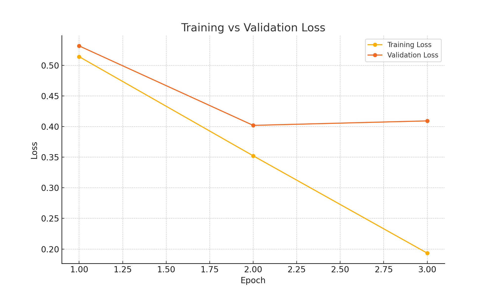
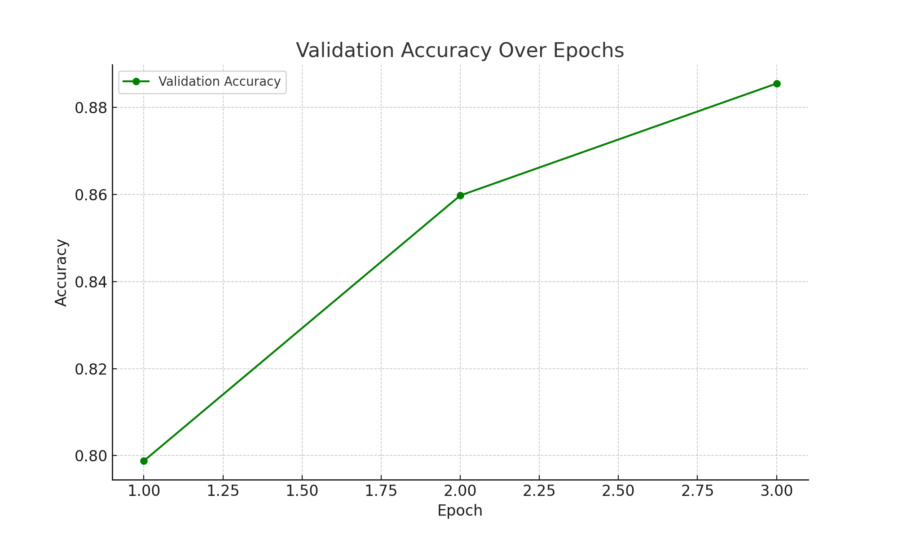
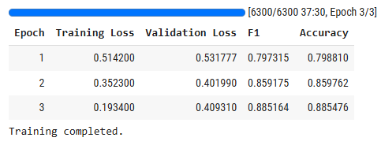

# BERT-Based Detection of Hate and Offensive Speech

## Overview
This project implements a BERT-based model for detecting hate speech and offensive language in social media content using natural language processing (NLP) and transformer-based architecture. It classifies text into three categories: **hate speech**, **offensive language**, and **neutral**. The model is trained on a combined dataset from **Davidson** and **HateXplain**, achieving a weighted F1-score and accuracy of **0.89**. This model can be used to enhance user safety.

## Features
- **BERT Model**: Uses `bert-base-uncased` for contextual text classification.
- **Datasets**: Combines Davidson (24,783 tweets) and HateXplain (20,148 posts).
- **Preprocessing**: Cleans text (removes URLs, mentions, special characters) and balances classes.
- **Performance**: Achieves a weighted F1-score and accuracy of 0.89.
- **Inference**: Provides real-time classification of input text via a user interface.

## Usage
All functionality is in a single Jupyter Notebook: `hate_speech_detection.ipynb`.

1. **Open the Notebook**:
   - Start Jupyter Notebook and open `hate_speech_detection.ipynb`.

2. **Run the Notebook**:
   - Execute cells sequentially to:
     - **Load and Preprocess Data**:
       - Loads Davidson and HateXplain datasets.
       - Cleans text (removes URLs, mentions, special characters).
       - Balances classes to ~42,000 entries (14,000 per class).
       - Splits data into training (80%), validation (10%), and test (10%) sets.
     - **Train the Model**:
       - Fine-tunes `bert-base-uncased` with:
         - Learning rate: `2e-5`
         - Batch size: 16
         - Epochs: 3
         - Optimizer: AdamW (weight decay: 0.01)
         - Early stopping: Based on weighted F1-score
       - Saves model and tokenizer to local directory.
     - **Evaluate and Visualize**:
       - Computes weighted F1-score and accuracy (0.89).
     - **Run Inference**:
       - Accepts user input text and outputs predicted label (hate speech, offensive language, or neutral) with confidence score.

## Results
- **Weighted F1-Score**: 0.89
- **Accuracy**: 0.89
- **Training Progress**:
  - Epoch 1: Training Loss: 0.51420, Validation Loss: 0.53178, F1-Score: 0.797
  - Epoch 2: Training Loss: 0.35230, Validation Loss: 0.40199, F1-Score: 0.859
  - Epoch 3: Training Loss: 0.19340, Validation Loss: 0.40931, F1-Score: 0.89
- **Visualizations**:
  - Training and validation loss curve:
    
  - Validation accuracy over epochs:
    
  - Training epoch results:
   

## Limitations
- **Sarcasm and Code-Mixed Text**: Challenges in detecting nuanced or mixed-language content.
- **Domain Generalization**: Performance may vary across platforms due to dataset biases.
- **Computational Resources**: Training benefits from GPU acceleration.

## Future Work
- Explore hybrid models (e.g., BERT with CNN or LSTM) for better sarcasm detection.
- Use multilingual datasets for cross-language support.
- Implement domain-specific pre-training for cross-platform generalization.
- Address biases and improve model explainability for ethical deployment.
